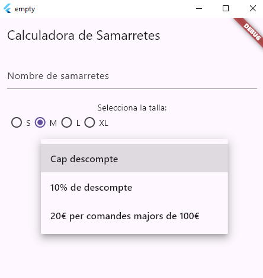
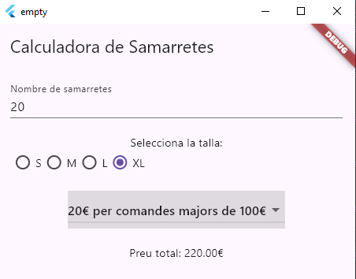

# Exercici 5 (proves unitàries)

## desenvolupament en mode TDD per a l'aplicació de samarretes

Aplicación Flutter para calcular precios de camisetas con sistema de descuentos, desarrollada con metodología TDD (Test-Driven Development).

## 📋 Características Principales
- ✅ Cálculo automático de precios en tiempo real
- 🧪 Pruebas unitarias completas para toda la lógica de negocio
- 🎨 Interfaz intuitiva con:
  - Selector de cantidad de camisetas
  - Radio buttons para tallas (S, M, L, XL)
  - Selector de descuentos (10%, 20€ en pedidos >100€)
- 💰 Sistema de descuentos configurable

## 🛠️ Tecnologías Utilizadas
- **Framework:** Flutter 3.13.9
- **Lenguaje:** Dart 3.1.3
- **Pruebas:** Paquete `test` (TDD)
- **Widgets Principales:**
  - `Radio` para selección de tallas
  - `DropdownButton` para descuentos
  - `TextField` para entrada numérica
- **Gestión de Estado:** `setState` con enfoque StatefulWidget

## 🧪 Desarrollo con TDD
Implementación siguiendo Test-Driven Development:

### 1. Pruebas Unitarias

#### Pruebas para cálculo básico de precio
test('Calcula preu sense descompte', () {
  expect(calculaPreuSamarretes(2, 'M'), equals(20.0));
});

#### Pruebas para descuento del 10%
test('Calcula descompte del 10%', () {
  expect(calculaDescompte(100.0, 1), equals(10.0));
});

#### Pruebas para descuento de 20€
test('Calcula descompte de 20€', () {
  expect(calculaDescompte(120.0, 2), equals(20.0));
});

#### Pruebas para precio final
test('Preu definitiu amb descompte 20€', () {
  expect(preuDefinitiu(10, 'L', 2), equals(90.0));
});


# 📦 Configuración de Dependencias (`pubspec.yaml`)

Sección relevante del archivo de configuración de Flutter con explicaciones técnicas:

```yaml
dependencies:
  flutter:
    sdk: flutter  # Dependencia principal del SDK de Flutter (obligatoria)
  
  test: ^1.24.0   # Versión 1.24.0 del paquete de testing para Dart (^ permite actualizaciones compatibles)
                   # Usado para pruebas unitarias de la lógica de negocio (TDD)
  
  flutter_test:
    sdk: flutter   # Paquete de testing específico para widgets Flutter (incluido en el SDK)
                   # Necesario para pruebas de interfaz de usuario y componentes visuales


```
### 2 .Implementación de Funciones

#### Cálculo de precio base
double calculaPreuSamarretes(int numero, String talla) {
  // Lógica de precios por talla
}

#### Cálculo de descuentos
double calculaDescompte(double preu, int tipusDescompte) {
  // Implementación de reglas de descuento
}

#### Cálculo de precio final
double preuDefinitiu(int numero, String talla, int descompte) {
  return calculaPreuSamarretes(numero, talla) - calculaDescompte(...);
}
### 3. Implementación de UI
Interfaz reactiva que actualiza automáticamente el precio

Validación de entrada de datos

Muestra condicional del precio solo con datos válidos


📂 Estructura del Código
Copy
lib/
├── main.dart            # Punto de entrada
├── samarretes.dart      # Lógica de negocio (funciones de cálculo)
test/
├── widget_test.dart     # Pruebas de la interfaz
└── samarretes_test.dart # Pruebas unitarias (TDD)
  
  
  
